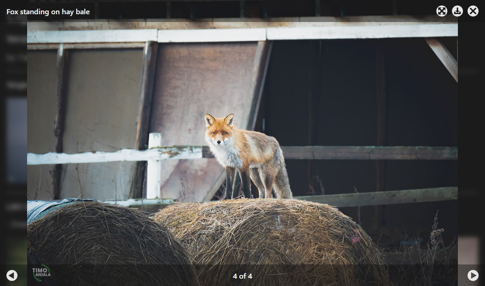

# LightBox Overlay - LBOgeneral</h1>

Lightbox Overlay - General is modern and simple image lightbox for all code projects that use HTML elements or accept HTML attributes.

For **React Projects**, use [LBOreact](#https://github.com/FakeManiGH/lightbox-overlay-react).

## Contents

- [Overview](#overview)
- [Setup](#setup)
- [Activation](#activation)
- [Image download](#image-download)
- [License (MIT)](#license)

## Overview

- **Build for:** All projects that use HTML elements, or work with HTML element attributes. Build with JavaScript version **ECMAScript 2023 (ES14)**
    - **Tested on:** HTML, PHP, and JavaScript -projects.
    - **DOM:** Built-in observer for DOM changes (new images).
- **CSS Styling:** All styling is done inside **lbo.css** -file. Colors, sizes and animations are customizable.
- **Responsive build:** LBOgeneral works on all display sizes from desktop to mobile. Detects new images.
- **Functionality:** Images browsed inside LBO can be downloaded if downloading for image is been allocated. LBO also has build in fullscreen mode to browse images in fullscreen.
- **Navigation:**
    - **Mouse:** Use built-in buttons with mouse.
    - **Keyboard:** LEFT and RIGHT arrows can be used for moving between images. ESC and BACKSPACE close the LBO.
    - **Touchscreen:** Move between images by swiping left and right. Close LBO by swiping up on screen.
- **Customization:** All styles are customizable from included CSS file. Functions are also customizable from JS file. No quick setups.

## Setup

1. Download the latest version of **LBOgeneral** in ZIP-file from [GitHub](https://github.com/FakeManiGH/lightbox-overlay-general).
2. Export **lbo.js** and **lbo.css** files from ./src folder to your project **htdocs** folder. You can also create subfolder.
3. Link both files to your documents HEAD section:
~~~HTML
<link rel="stylesheet" href="location/of/lbo.css">

~~~
4. Move to activiting LBO for your images.

## Activation

**For single image:**

~~~HTML

~~~

**For image gallery:**

~~~HTML

~~~

> Remember to add **alt** -attribute for each image, for accessibility.

## Image Download

Any image setup with LBO can be allocated to be downloaded by user. In LBO galleries you can allocate download for images of your choosing. Simply add **data-download="yes"** attribute for image element. Without this attribute, downloading for set image is disabled.

~~~HTML

~~~

## License (MIT)

The MIT License

Copyright (c) 2024 Timo Anjala

Permission is hereby granted, free of charge, to any person obtaining a copy
of this software and associated documentation files (the "Software"), to deal
in the Software without restriction, including without limitation the rights
to use, copy, modify, merge, publish, distribute, sublicense, and/or sell
copies of the Software, and to permit persons to whom the Software is
furnished to do so, subject to the following conditions:

The above copyright notice and this permission notice shall be included in all
copies or substantial portions of the Software.

THE SOFTWARE IS PROVIDED "AS IS", WITHOUT WARRANTY OF ANY KIND, EXPRESS OR
IMPLIED, INCLUDING BUT NOT LIMITED TO THE WARRANTIES OF MERCHANTABILITY,
FITNESS FOR A PARTICULAR PURPOSE AND NONINFRINGEMENT. IN NO EVENT SHALL THE
AUTHORS OR COPYRIGHT HOLDERS BE LIABLE FOR ANY CLAIM, DAMAGES OR OTHER
LIABILITY, WHETHER IN AN ACTION OF CONTRACT, TORT OR OTHERWISE, ARISING FROM,
OUT OF OR IN CONNECTION WITH THE SOFTWARE OR THE USE OR OTHER DEALINGS IN THE
SOFTWARE.